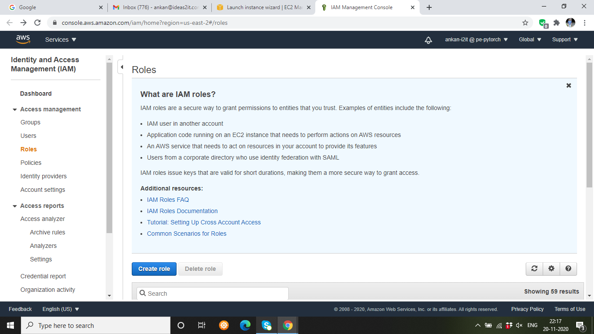
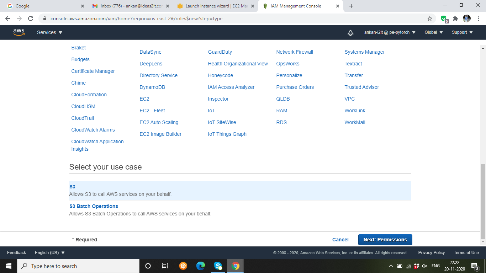
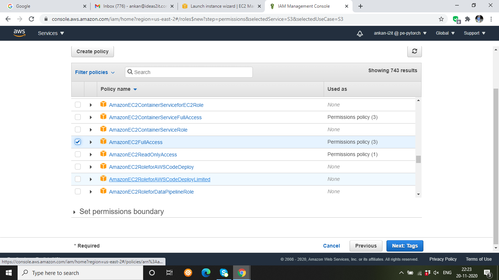
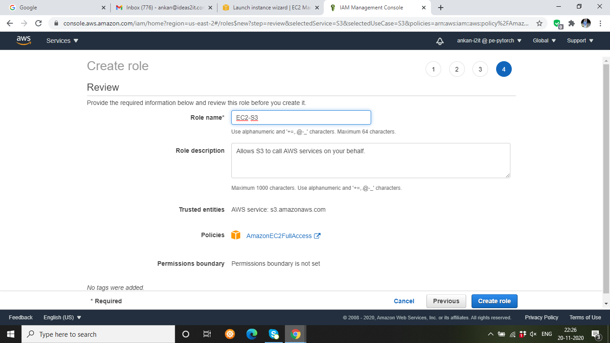
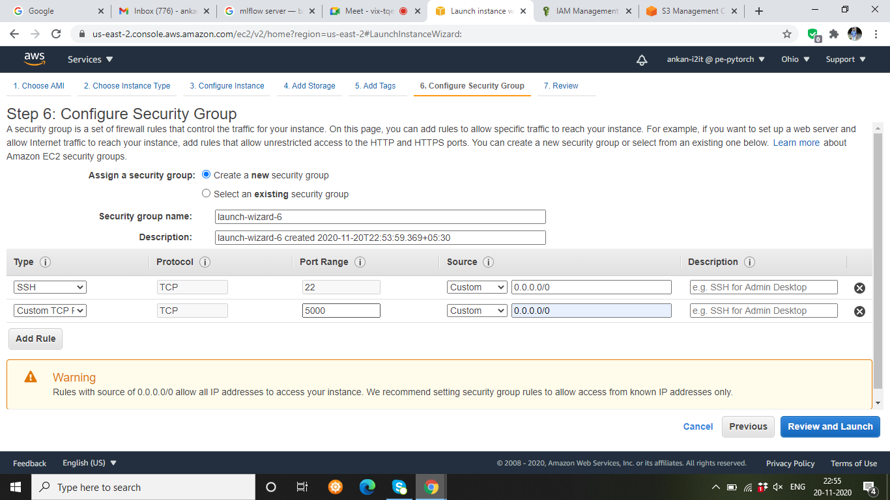

Steps to Install MLflow with SQL/S3 backend
===========================================

1. Start by launching a new Instance in EC2 with required “Type” (e.g t2.medium)

2. In the Configure Instance Details click on **Create new IAM role** where we need to update the  configuration to access S3 via EC2.

3. In the window that opens, click on Create Role as shown below:

4. Select the S3 service from the list of services.

5. After you have selected the S3 service choose the use case for the S3 bucket as “Allows S3 to call AWS services on your behalf.” and click **Next Permissions**

6. Choose the policy **AmazonEC2FullAccess**

7. Add the key name

8. Provide the name to the role and create the role

9. While Configuring Instance Details, now select the newly created IAM role(IAM role).

10. For storage increase to sufficient amount(50 gb).

11. As a next type Configure Security Group create a new security group and add rule with port 5000(default for MLflow) as shown below:

12. Launch the EC2 instance.

13. `Install Anaconda <https://www.digitalocean.com/community/tutorials/how-to-install-anaconda-on-ubuntu-18-04-quickstart>`_ in the machine.

14. `Install MLflow <https://www.mlflow.org/docs/latest/quickstart.html>`_

15. `Install MySQL <https://dev.mysql.com/doc/mysql-installation-excerpt/8.0/en/windows-install-archive.html>`_

16. Create a bucket in S3 (e.g mlflow_bucket)

17. Inside the bucket create a folder (eg : “mlflow” ) which will be the artifact folder.

18. Invoke the following to start set the MLflow server with S3/SQL backend \
`mlflow server --backend-store-uri mysql+pymysql://root:strongpassword@db:3306/db --default-artifact-root s3://mlflow_bucket/mlflow/  -h 0.0.0.0 -p 5000`

**Reference**: - https://towardsdatascience.com/deploy-mlflow-with-docker-compose-8059f16b6039
